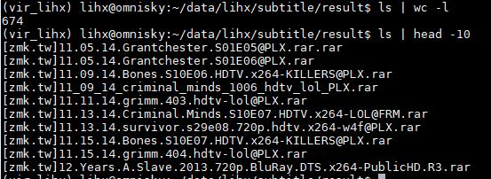

# subtitle-spider

## Goal

Make a spider to scrowl subtitle data from website [字幕库](http://www.zimuku.net/). 

## About me
```javascript
  scrapy runspider shareditor.py
```
## Prerequisites

- Python 2.7 or Python 3.3+
- [Scrapy](https://scrapy.org/)

## Usage

Go to the top folder(subtitle) and run it like this:

```javascript
  scrapy runspider subtitle/spiders/subtitle_spider.py
```

## Results



